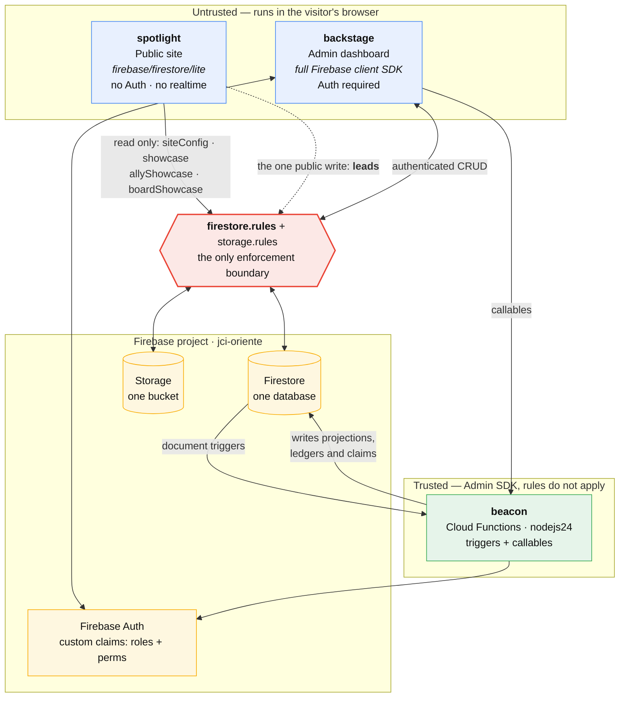
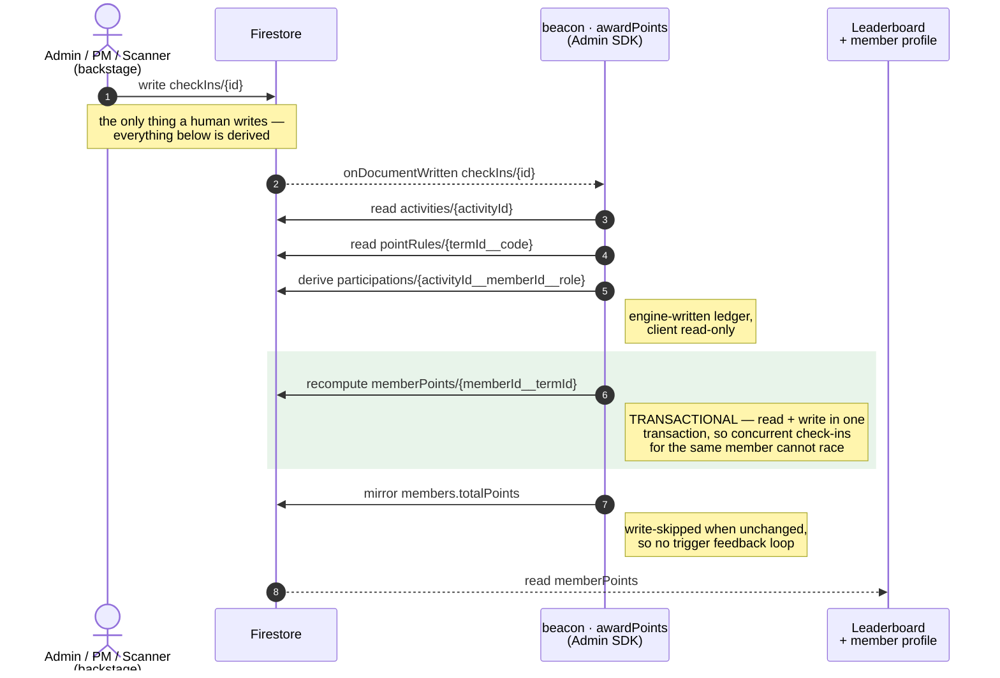
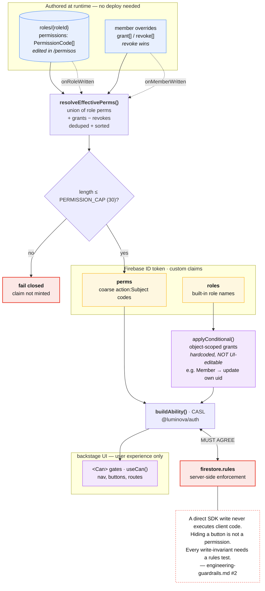
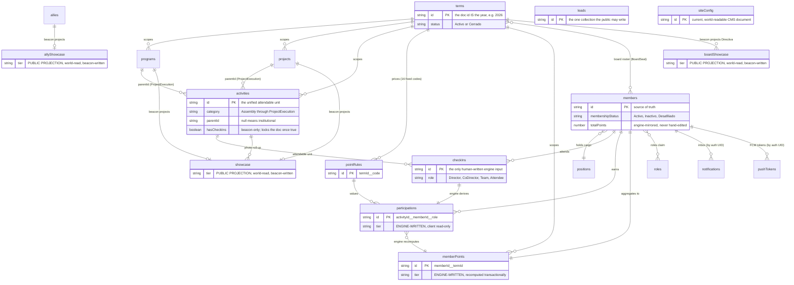

# Architecture

## System Overview



_Source: [`docs/diagrams/container.mmd`](diagrams/container.mmd) — edit there, then re-embed._

Both web apps (spotlight and backstage) are registered as separate Firebase web app entries
within the same project and share one Firestore database and one Storage bucket
(`jci-oriente.firebasestorage.app`). Each app has its own App Check configuration.

## Apps

### spotlight (Public Site)
- React SPA deployed to Firebase Hosting target `jcioriente`
- Ships **no full Firebase client** — public data (`siteConfig`, `showcase`,
  `allyShowcase`) is read through the lightweight `firebase/firestore/lite` subpath via
  `@luminova/firebase/lite` (no Auth, no realtime)
- Public routes do not require authentication
- Contact form writes a `leads` doc directly (the one public write the site performs) —
  `src/leads/submit-lead.ts` via the lite SDK, gated by `leadCreateValid()` in
  `firestore.rules`; triaged in backstage at `/leads`
- Firebase web app registration: `1:953870918238:web:63d0034740735d618b4acf`

### backstage (Admin Dashboard)
- React SPA with Firebase Auth + Firestore, deployed to Firebase Hosting target `jcioriente-backstage`
- Imports `@luminova/firebase` at boot (always included in the bundle)
- All routes except `/login`, `/forgot-password`, and `/reset` require authentication
- CRUD/admin surfaces: members, positions, initiatives (programs/projects), activities
  + QR check-in, point rules, allies, roles/permissions (`/permisos`), site config (`/config`)
- Member profile pictures and initiative/activity photos stored in Firebase Storage
- Firebase web app registration: `1:953870918238:web:acbd53d377846bd88b4acf`

### beacon (Cloud Functions)
- Node.js 24 Firebase Cloud Functions (runtime: `nodejs24`, functions codebase `beacon`)
- Firestore triggers: `awardPoints` (`checkIns/{id}` — the Recognition Engine),
  `onProgramWritten` / `onProjectWritten` (roster → participation reconciliation +
  `showcase` projection), `onActivityWritten` (photo roll-up into the showcase),
  `onMemberWritten` (custom-claims sync: roles + perms), `onRoleWritten` (role-definition
  claims re-sync), `onAllyWritten` (`allyShowcase` public projection),
  `onMemberCreated` (stamps the `publicProfile` opt-out default — clients may not set it),
  `onBoardMemberWritten` (`boardShowcase` public Directiva projection),
  `onNotificationCreated` (inbox fan-out + best-effort FCM)
- Callables: `setUserRoles`, `seedRoles`, `recomputeAllClaims`, `provisionMemberLogin`
- Uses Firebase Admin SDK (server-side only)

## Data Flow: Point Calculation



_Source: [`docs/diagrams/checkin-points.mmd`](diagrams/checkin-points.mmd)_

## Shared Packages

### @luminova/firebase
Memoized `getFirebase()` client singleton with App Check + emulator wiring.
Initializes Firebase app, Auth, Firestore, and Storage on first call; subsequent calls return
the cached instance. Optionally initializes App Check (reCAPTCHA v3) when
`VITE_APPCHECK_SITE_KEY` is set. Connects all services to emulators when
`VITE_FIREBASE_EMULATOR_ENABLED=true`. Both frontend apps import from this package;
spotlight uses the `@luminova/firebase/lite` subpath (`firebase/firestore/lite`, no Auth)
to keep the public bundle small.

### @luminova/ui
Bespoke token-driven component library built on Tailwind CSS utilities.
shadcn/Radix UI components are added for complex widgets via `pnpm dlx shadcn@latest add`.
Both Spotlight and Backstage consume from here.

### @luminova/types
TypeScript interfaces + Zod schemas for all Firestore documents (built package, emits
`dist/`). Shared by the frontend apps **and** beacon: pure engine types + helpers live
under the `@luminova/types/engine` subpath (framework-free, admin-SDK safe).

### @luminova/utils
`cn()` utility (clsx + tailwind-merge). Shared across all apps.

## Monorepo Task Orchestration (Turborepo)

```
build / typecheck / ci
  └── depends on: ^build (packages build before apps)

dev / preview
  └── cache: false, persistent: true

lint / test
  └── no dependencies
```

Deploys are **not** turbo tasks: manual deploys run via the root `pnpm deploy:*` scripts
(`deploy:rules`, `deploy:indexes`, `deploy:functions`, `deploy:hosting`, `deploy:all`),
and the normal path to production is the keyless, approval-gated CD pipeline — see
`docs/ci-cd.md`.

## Local Development

1. Start everything: `pnpm dev` — boots the Firebase emulators, waits for them, seeds
   the emulator (`pnpm seed:emulator`), then starts all apps
2. Spotlight at `http://localhost:5173`
3. Backstage at `http://localhost:5174`
4. Emulator UI at `http://localhost:4100`

## Authorization

Two independent claim streams reach the CASL ability. Coarse `action:Subject`
permissions come from the `perms` claim, resolved from runtime-editable
`roles/{roleId}` documents plus per-member grant/revoke overrides (revoke wins) and
capped at `PERMISSION_CAP` (30) — over the cap the claim is **not minted at all**, so
authority fails closed. Object-scoped conditional grants come from the built-in
`roles` claim instead and are hardcoded in `applyConditional()`, deliberately not
editable in `/permisos`.

The client ability drives UX only. `firestore.rules` is the enforcement boundary, and
the two must agree — a direct SDK write never executes client code. See
[`engineering-guardrails.md`](engineering-guardrails.md) #2.



_Source: [`docs/diagrams/authz.mmd`](diagrams/authz.mmd)_

## Data Model

Collections fall into four write tiers, and the tier tells you who may write:

| Tier | Collections | Writer |
|------|-------------|--------|
| Source of truth | members · positions · terms · programs · projects · activities · pointRules · allies · roles · siteConfig · checkIns · leads | admins, rules-gated (`leads` is the one public write) |
| Engine-written | participations · memberPoints | beacon only; clients read-only |
| Public projections | showcase · allyShowcase · boardShowcase | beacon only; world-readable |
| Per-user | notifications · pushTokens | keyed by Firebase Auth UID, not memberId |

Field-level schemas live in [`data-models.md`](data-models.md); this diagram carries
only the relationships and the composite keys, which are the non-obvious part.



_Source: [`docs/diagrams/data-model.mmd`](diagrams/data-model.mmd)_

## Delivery Pipeline

Three hard gates, two of them on the contributor's own machine. Full detail in
[`ci-cd.md`](ci-cd.md).

```mermaid
%% Luminova — from a local edit to production
%% Three hard gates, two of them on the contributor's own machine. Nothing reaches
%% production unattended, and no long-lived deploy credential exists anywhere.
%% Source of truth: docs/ci-cd.md sections 1-4, CLAUDE.md Tooling Index

flowchart TB
    subgraph local["On the contributor's machine — git hooks"]
        edit["edit in a worktree<br/><i>.worktrees/slug</i>"]
        bguard{"<b>branch-guard.sh</b><br/>on main?"}
        precommit["<b>pre-commit.sh</b><br/>format · lint · typecheck<br/><i>auto-fixes, then re-stages</i>"]
        router["<b>review-router.sh</b><br/>computes the mandated<br/>review set from the diff"]
        rgate{"<b>review-gate.sh</b><br/>fresh review trailer<br/>covering this diff?"}
        blocked["<b>blocked</b> — exit 2"]
    end

    subgraph ci["CI · ci.yml — every PR"]
        checks["checks<br/>build · lint · typecheck · test<br/>bundle-budget · audit"]
        emu["emulator suites<br/>Firestore + Storage rules<br/>beacon race guards"]
    end

    merge(["merge to main"])

    subgraph cd["CD · deploy.yml — on CI success on main"]
        filter["<b>filter</b><br/>which surfaces changed?"]
        approve{{"<b>reviewer approval</b><br/>GitHub production environment<br/><i>one click, always required</i>"}}
        drules["deploy-rules<br/>firestore + storage + indexes"]
        dfunc["deploy-functions<br/>beacon gen2"]
        dhost["deploy-hosting"]
        preview["preview channel<br/><i>ci-sha, expires in 1 day</i>"]
        smoke["smoke test"]
        promote["promote to live"]
    end

    edit --> bguard
    bguard -->|yes| blocked
    bguard -->|no| precommit
    precommit --> router
    router --> rgate
    rgate -->|no| blocked
    rgate -->|yes| checks

    checks --> emu
    emu --> merge
    merge --> filter
    filter --> approve
    approve --> drules
    drules --> dfunc
    dfunc --> dhost
    dhost --> preview
    preview --> smoke
    smoke --> promote

    pillars["<b>Why it is shaped this way</b><br/>• <b>Keyless</b> — WIF/OIDC; no service-account key exists<br/>  in GitHub secrets or on disk. A leaked env var is inert.<br/>• <b>Human-gated</b> — no unattended production change.<br/>• <b>Least blast radius</b> — only the changed surface deploys,<br/>  in the order data contract → backend → UI.<br/>• <b>Never serves unverified</b> — hosting goes preview → smoke → live,<br/>  which is why there is no rollback step."]
    promote --- pillars

    classDef gate fill:#fce8e6,stroke:#ea4335,stroke-width:2px,color:#111
    classDef pass fill:#e6f4ea,stroke:#34a853,color:#111
    classDef human fill:#fef7e0,stroke:#f9ab00,stroke-width:2px,color:#111
    classDef note fill:#fff,stroke:#5f6368,stroke-dasharray:3 3,color:#111
    class bguard,rgate,blocked gate
    class checks,emu,promote pass
    class approve human
    class pillars note
```



_Source: [`docs/diagrams/pipeline.mmd`](diagrams/pipeline.mmd)_
